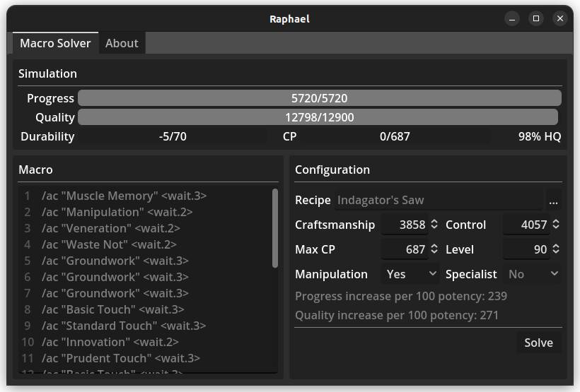

# Raphael




Raphael is a standalone crafting macro solver for the online game Final Fantasy XIV.

**Features:**
* Produces fully-solved macros (i.e. no hand-tuned branch pruning)
* Uses a reasonable amount of resources:
    * Time: ~7 seconds (single-threaded)
    * Memory: ~500 MB
* Deterministic (i.e. produces the same macro when given the same parameters).

## Installing from source

> [!NOTE]
> Pre-compiled binaries can be found under [Releases](https://github.com/KonaeAkira/raphael-rs/releases).
> Building the program from source code isn't recommended unless you have a good reason to do so.

### Prerequisites

The following dependencies need to be installed on your computer:

* [Rust](https://www.rust-lang.org/) is required to build the solver back-end.
* [Godot 4](https://godotengine.org/) is required to build the graphical front-end.

### Supported platforms

Raphael should work on all platforms that both Rust and Godot support.
However, only the following platforms have been tested:

* x86-64 Linux
* x86-64 Windows 10/11

Building for other platforms will require some tweaking.

### Build steps

#### Building the solver back-end

On Linux:

```
cargo build --release --target x86_64-unknown-linux-gnu
```

On Windows:

```
cargo build --release --target x86_64-pc-windows-gnu
```

#### Building the graphical interface

1. Open Godot 4 and import the project at `godot_application/project.godot`
2. In the top-left corner, select `Project > Export...`
3. Select the platform you want to build for (either "Linux/X11" or "Windows Desktop")
4. Select "Export Project...", uncheck "Export With Debug", and select the directory where the resulting executable should lie.
5. You're done! Raphael can now be launched using the executable you just created.
